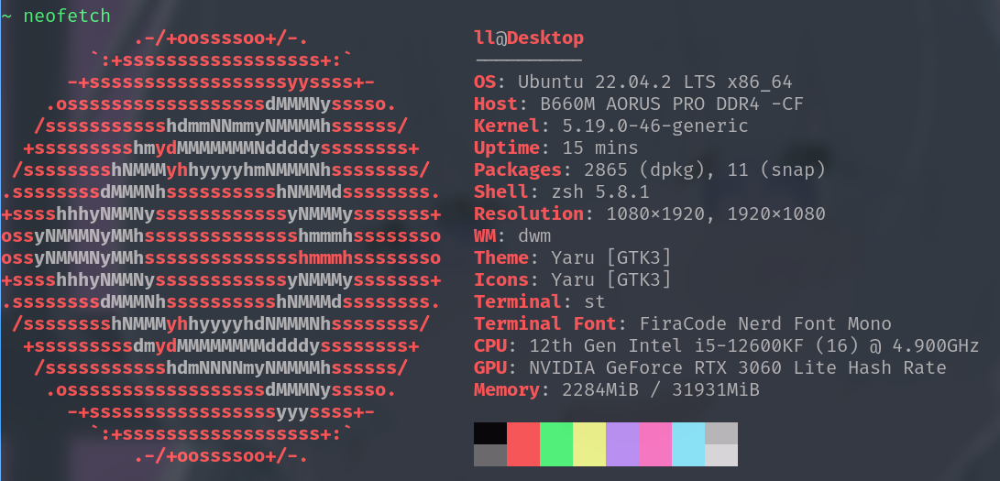

# Linux Kernel Laboratory

| Date       | Author  | Description   |
| ---------- | ------- | ------------- |
| 2023/07/02 | Manfred | First Release |

This repository is intended as a recorder of my process of learning mechanism in linux kernel, several key items to meet this goal are listed below:

- [ ] ADT
- [ ] Blocking
- [x] Asynchronous
- [ ] Synchronous
- [ ] Interrupt
- [x] Dynamic output
- [ ] Proc
- [x] Debugfs
- [ ] Sysfs
- [x] Notifier
- [ ] Oops

**Experimental Environment**

---

If you have any questions, please feel free to leave a message or email me directly. I am looking forward to assisting you. 

Email:1259106665@qq.com/manfredxxc@gmail.com
