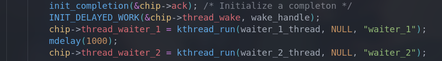
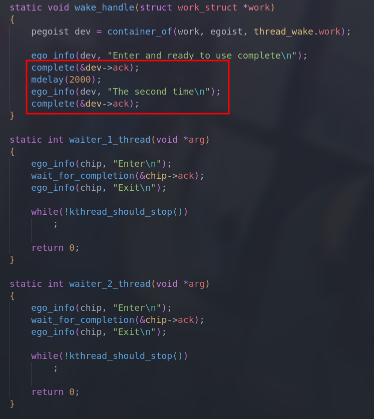
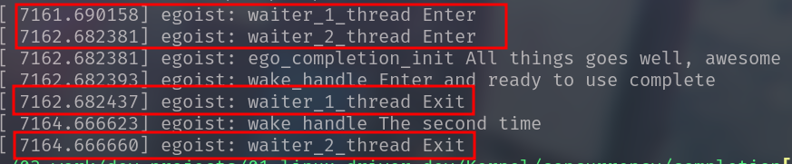

# 并发和竞态

| Date       | Author  | Description               |
| ---------- | ------- | ------------------------- |
| 2023/07/06 | Manfred | First release : semaphore |

**竞态**

对资源的共享访问

**并发**

不止一个执行线程操作共享资源


*并发的产生是多样的，主要原因有SMP系统、抢占式内核、设备中断等。资源被多个执行线程共享访问，由于各个线程对资源（临界区）的观察不一致，会导致错误的访问模式，进而产生非预期的结果*

---

**因此，必须对并发进行管理**


# 并发管理

**Principle**

1. 避免资源共享
   - 避免使用全局变量
   - note:指针的传递可能建立新的共享
2. 确保一次只有一个执行线程去操作共享资源
   - 信号量
   - 完成量
   - 自旋锁、互斥锁
   - 原子变量
   - 免锁算法
   - RCU

## 信号量

### 概述

`<linux/semaphore.h>`

~~~c
/* Please don't access any member of this structure directly */
struct semaphore {
    raw_spinlock_t		lock;
    unsigned int		count;
    struct list_head	wait_list;
};
~~~

信号量本质上是一个整数值，和一对联合函数配合使用——P和V，希望进入临界区的进程在相关信号量上调用它们

**P**：获取信号量

- 如果信号量值大于0，则该值会减一
- 如果信号量值小于等于0，则进程必须等待，知道他人释放该信号量

**V**：释放信号量

- 信号量的值增加1，必要时唤醒等待进程

常见对信号量的使用是将值设为1，这种模式被称为`互斥`，即实现了临界区的控制——一次只有一个进程获得信号量，随后对临界区进行操作

---

### API

- 初始化
- 减少（获取）信号量
- 增加（释放）信号量

#### -1- 初始化

~~~c
/* Static */
#define __SEMAPHORE_INITIALIZER(name, n)			\
{
	,lock		= __RAW_SPIN_LOCK_UNLOCKED((name).lock),	\
    .count		= n,						\
    .wait_list	= LIST_HEAD_INIT((name),wait_list),	\
}
#define DEFINE_SEMAPHORE(name)	\
	struct semaphore name = __SEMAPHORE_INITIALIZER(name, 1)

/* Dynamic */
static inline void sema_init(struct semaphore *sem, int val)
{
    static struct lock_class_key __key;
    *sem = (struct semaphore) __SEMAPHORE_INITIALIZER(*sem, val);
    lockdep_init_map(&sem->lock.dem_map, "semaphore->lock", &__key, 0);
}
~~~

**Demo**

```c
static DEFINE_SEMAPHORE(sem);
```

```c
struct semaphore sem
sema_init(&sem, 1); /* mutex:normal */
```

#### -2- 减少（获取）信号量

```c
extern void dwon(struct semaphore *sem);
/* 减少信号量的值，当信号量不大于0时，转入休眠状态直至信号量可用（>0） */
extern int __must_check down_interruptible(struct semaphore *sem);
/* 休眠可以被信号中断，被中断则返回-EINTR，且调用者不会获取信号量 */
extern int __must_check down_killable(struct semaphore *sem);
/* 休眠可以被致命信号中断，被中断则返回-EINTR，且调用者不会获取信号量 */
extern int __must_check down_trylock(struct semaphore *sem);
/* 不会休眠，立即返回。尝试获取信号量，获得则返回0，不可获得则返回1 */
extern int __must_check down_timeout(struct semaphore *sem, long jiffies);
/* down的自定义超时版本 */
```

> __must_check 前缀代表调用函数一定要处理函数的返回值，否则编译器会给出警告
>
> 工程中推荐使用 `interruptible`版本

#### -3- 增加（释放）信号量

### Instance

[ego_semaphore.c](./semaphore/ego_semaphore.c)

该实例使用信号量实现了经典的同步，线程A获取信号量并在结束时释放，而另外一个线程B也需要该信号量，满足不了则B进入睡眠，直到A释放信号量，便实现了AB的同步

**[Result]**


## RW信号量


## 完成量

### 概述

`Completion`使用FIFO排列需要等待`Completion->done`的线程，当条件满足时唤醒线程。它是一种比信号量和锁更可取的同步机制，避免了多线程之间的竞争且开销更小

`<linux/completion.h>`

~~~c
/*
 * struct completion - structure used to maintain state for a "completion"
 *
 * This is the opaque structure used to maintain the state for a "completion".
 * Completions currently use a FIFO to queue threads that have to wait for
 * the "completion" event.
 *
 * See also:  complete(), wait_for_completion() (and friends _timeout,
 * _interruptible, _interruptible_timeout, and _killable), init_completion(),
 * reinit_completion(), and macros DECLARE_COMPLETION(),
 * DECLARE_COMPLETION_ONSTACK().
 */
struct completion {
	unsigned int done;
	wait_queue_head_t wait;
};
~~~

`completion`由一个`done`计数和`simple wait queue`简易等待队列组成，非常简单

- done：维护现在的完成量的值
- wait：维护一条等待队列

### API

#### -1- 初始化

```c
/* Static */
#define DECLARE_COMPLETION(work) \
	struct completion work = COMPLETION_INITIALIZER(work)

/* Dynamic */
static inline void init_completion(struct completion *x)
{
	x->done = 0;
	init_waitqueue_head(&x->wait);
}

/* Reuse */
static inline void reinit_completion(struct completion *x)
{
	x->done = 0;
}
```

**Note**

`reinit`只是简单的把`done`的值重置，方便对`completion`的再利用，使用场景是调用`complete_all()`之后

---

#### -2- 等待完成量

```c
/**
 * wait_for_completion: - waits for completion of a task
 * @x:  holds the state of this particular completion
 *
 * This waits to be signaled for completion of a specific task. It is NOT
 * interruptible and there is no timeout.
 *
 * See also similar routines (i.e. wait_for_completion_timeout()) with timeout
 * and interrupt capability. Also see complete().
 */
void __sched wait_for_completion(struct completion *x)
{
	wait_for_common(x, MAX_SCHEDULE_TIMEOUT, TASK_UNINTERRUPTIBLE);
}
EXPORT_SYMBOL(wait_for_completion);

/* Friends */
extern void wait_for_completion_io(struct completion *);
extern int wait_for_completion_interruptible(struct completion *x);
extern int wait_for_completion_killable(struct completion *x);
extern unsigned long wait_for_completion_timeout(struct completion *x,
						   unsigned long timeout);
extern unsigned long wait_for_completion_io_timeout(struct completion *x,
						    unsigned long timeout);
extern long wait_for_completion_interruptible_timeout(
	struct completion *x, unsigned long timeout);
extern long wait_for_completion_killable_timeout(
	struct completion *x, unsigned long timeout);
```

`wait_for_completion`将线程加入等待队列，等待特定任务完成，其他的朋友变体传给核心函数`wait_for_common`不同的参数，以实现不同的特性如可被中断、设定超时等

**进一步剖析：**

```c
/* Part 1 */
static inline long __sched
__wait_for_common(struct completion *x,
		  long (*action)(long), long timeout, int state)
{
	might_sleep();

	spin_lock_irq(&x->wait.lock);
	timeout = do_wait_for_common(x, action, timeout, state);
	spin_unlock_irq(&x->wait.lock);
	return timeout;
}
/* Part 2 */
static inline long __sched
do_wait_for_common(struct completion *x,
		   long (*action)(long), long timeout, int state)
{
	if (!x->done) {
		DECLARE_WAITQUEUE(wait, current);

		__add_wait_queue_tail_exclusive(&x->wait, &wait);
		do {
			if (signal_pending_state(state, current)) {
				timeout = -ERESTARTSYS;
				break;
			}
			__set_current_state(state);
			spin_unlock_irq(&x->wait.lock);
			timeout = action(timeout);
			spin_lock_irq(&x->wait.lock);
		} while (!x->done && timeout);
		__remove_wait_queue(&x->wait, &wait);
		if (!x->done)
			return timeout;
	}
	x->done--;
	return timeout ?: 1;
}
```

**Part 1**

```c
/* Attach to any functions which should be ignored in wchan output. */
#define __sched		__attribute__((__section__(".sched.text")))
```

首先是`__sched`标志，它表示把带有`__sched`的函数加入到`.sched.text`字段，表示函数将不会在`waiting channel`中显示

`waiting channel`：在kernel中，如果用户空间的进程睡眠了，可以查询到它停留在哪个内核函数中等待

```bash
cat /proc/<pid>/wchan
```

**Part 2**

首先检查`done`值

- 不为0,使 done - 1，返回
- 为0,则把自己加入到等待队列中，睡眠直到信号量不为0或者超时，能否被中断信号等唤醒取决于传入的`state`

do while逻辑

- 去锁，休眠
- 被信号唤醒、完成量条件满足(done > 0)、超时

**小结**

核心操作函数`wait_for_completion()`，在完成量不够的情况下，将当前线程加入到等待队列休眠，每次被唤醒时检查完成量、信号、超时。一般逻辑是完成量条件满足，线程从等待队列中移除，继续执行

---

#### -3- 完成

```c
/**
 * complete: - signals a single thread waiting on this completion
 * @x:  holds the state of this particular completion
 *
 * This will wake up a single thread waiting on this completion. Threads will be
 * awakened in the same order in which they were queued.
 *
 * See also complete_all(), wait_for_completion() and related routines.
 *
 * It may be assumed that this function implies a write memory barrier before
 * changing the task state if and only if any tasks are woken up.
 */
void complete(struct completion *x)
{
	unsigned long flags;

	spin_lock_irqsave(&x->wait.lock, flags);
	x->done++;
	__wake_up_locked(&x->wait, TASK_NORMAL, 1);
	spin_unlock_irqrestore(&x->wait.lock, flags);
}
EXPORT_SYMBOL(complete);

/**
 * complete_all: - signals all threads waiting on this completion
 * @x:  holds the state of this particular completion
 *
 * This will wake up all threads waiting on this particular completion event.
 *
 * It may be assumed that this function implies a write memory barrier before
 * changing the task state if and only if any tasks are woken up.
 */
void complete_all(struct completion *x)
{
	unsigned long flags;

	spin_lock_irqsave(&x->wait.lock, flags);
	x->done += UINT_MAX/2;
	__wake_up_locked(&x->wait, TASK_NORMAL, 0);
	spin_unlock_irqrestore(&x->wait.lock, flags);
}
EXPORT_SYMBOL(complete_all);

#define UINT_MAX	(~0U)
```

`complete()`

> 行为是使信号量+1,然后从等待队列中唤醒一个线程

`complete_all()`

> 拉满信号量 line-38
>
> 唤醒所有等待队列中的线程 line-39 

---

### Instance

[ego_completion.c](./completion/ego_completion.c)

该实例定义了一个延时队列和两个线程

- 等待队列中调用了两次`complete()`，间隔时间为2S
- 两个线程都调用了`wait_for_completion()`，但两个线程启动的时间不一致，则加入等待队列的顺序不一样

启动这两个线程，此时完成量为0,延时队列中依次调用`complete()`，逐个唤醒两个线程





**[Result]**


