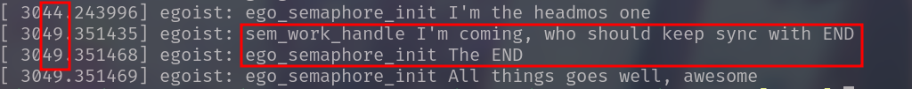

# 并发和竞态

| Date       | Author  | Description               |
| ---------- | ------- | ------------------------- |
| 2023/07/06 | Manfred | First release : semaphore |

**竞态**

对资源的共享访问

**并发**

不止一个执行线程操作共享资源


*并发的产生是多样的，主要原因有SMP系统、抢占式内核、设备中断等。资源被多个执行线程共享访问，由于各个线程对资源（临界区）的观察不一致，会导致错误的访问模式，进而产生非预期的结果*

---

**因此，必须对并发进行管理**


# 并发管理

**Principle**

1. 避免资源共享
   - 避免使用全局变量
   - note:指针的传递可能建立新的共享
2. 确保一次只有一个执行线程去操作共享资源
   - 信号量
   - 完成量
   - 自旋锁、互斥锁
   - 原子变量
   - 免锁算法
   - RCU

## 信号量

### 概述

`<linux/semaphore.h>`

~~~c
/* Please don't access any member of this structure directly */
struct semaphore {
    raw_spinlock_t		lock;
    unsigned int		count;
    struct list_head	wait_list;
};
~~~

信号量本质上是一个整数值，和一对联合函数配合使用——P和V，希望进入临界区的进程在相关信号量上调用它们

**P**：获取信号量

- 如果信号量值大于0，则该值会减一
- 如果信号量值小于等于0，则进程必须等待，知道他人释放该信号量

**V**：释放信号量

- 信号量的值增加1，必要时唤醒等待进程

常见对信号量的使用是将值设为1，这种模式被称为`互斥`，即实现了临界区的控制——一次只有一个进程获得信号量，随后对临界区进行操作

---

### API

- 初始化
- 减少（获取）信号量
- 增加（释放）信号量

#### -1- 初始化

~~~c
/* Static */
#define __SEMAPHORE_INITIALIZER(name, n)			\
{
	,lock		= __RAW_SPIN_LOCK_UNLOCKED((name).lock),	\
    .count		= n,						\
    .wait_list	= LIST_HEAD_INIT((name),wait_list),	\
}
#define DEFINE_SEMAPHORE(name)	\
	struct semaphore name = __SEMAPHORE_INITIALIZER(name, 1)

/* Dynamic */
static inline void sema_init(struct semaphore *sem, int val)
{
    static struct lock_class_key __key;
    *sem = (struct semaphore) __SEMAPHORE_INITIALIZER(*sem, val);
    lockdep_init_map(&sem->lock.dem_map, "semaphore->lock", &__key, 0);
}
~~~

**Demo**

```c
static DEFINE_SEMAPHORE(sem);
```

```c
struct semaphore sem
sema_init(&sem, 1); /* mutex:normal */
```

#### -2- 减少（获取）信号量

```c
extern void dwon(struct semaphore *sem);
/* 减少信号量的值，当信号量不大于0时，转入休眠状态直至信号量可用（>0） */
extern int __must_check down_interruptible(struct semaphore *sem);
/* 休眠可以被信号中断，被中断则返回-EINTR，且调用者不会获取信号量 */
extern int __must_check down_killable(struct semaphore *sem);
/* 休眠可以被致命信号中断，被中断则返回-EINTR，且调用者不会获取信号量 */
extern int __must_check down_trylock(struct semaphore *sem);
/* 不会休眠，立即返回。尝试获取信号量，获得则返回0，不可获得则返回1 */
extern int __must_check down_timeout(struct semaphore *sem, long jiffies);
/* down的自定义超时版本 */
```

> __must_check 前缀代表调用函数一定要处理函数的返回值，否则编译器会给出警告
>
> 工程中推荐使用 `interruptible`版本

#### -3- 增加（释放）信号量

### Instance

[ego_semaphore.c](./semaphore/ego_semaphore.c)

该实例使用信号量实现了经典的同步，线程A获取信号量并在结束时释放，而另外一个线程B也需要该信号量，满足不了则B进入睡眠，直到A释放信号量，便实现了AB的同步

**[Result]**



## RW信号量


