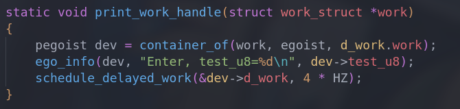
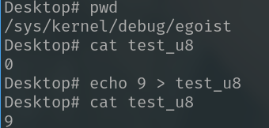
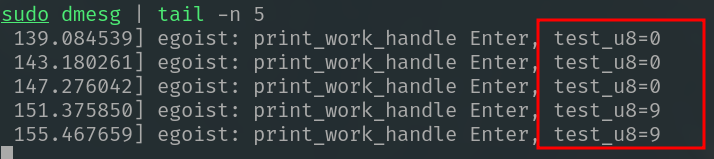

# Debugfs

**General description**

The debugfs allows user make modifications to value on running kernel

The biggest feature of debugfs is that it's complete freedom! As the sysfs is for LDM, proc is for process

---

**Location**

Debugfs is usually mounted at `/sys/kernel/debug`

User can also mount it through command below:

```bash
mount -t debugfs none /sys/kernel/debug
```

---

**Demo**

[ego_debugfs.c](./ego_debugfs.c)

I create a subdirectory named `egoist` on `/sys/kernel/debug`, a debugfs-value named `test_u8` is under it, it's our experimental subject.


A self-scheduling delayed_work is running every 4 seconds, it shows the value of `test_u8`



---

While the delayed_work running, I change the `test_u8` through debugfs, and the result as below





**[Result]**

As you see, it works.


