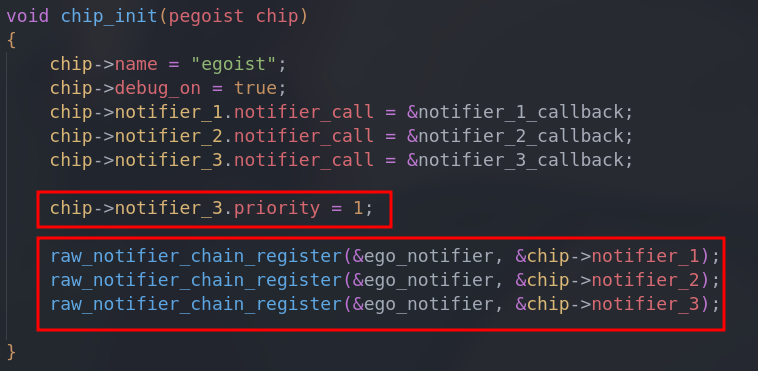
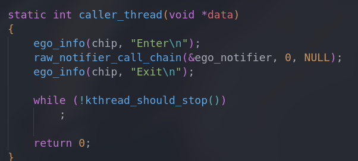
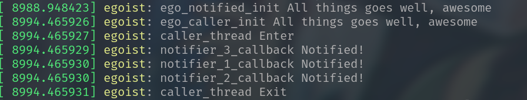

# Notifier

| Date       | Author  | Description   |
| ---------- | ------- | ------------- |
| 2023/06/30 | Manfred | First release |

> This note is intended as a study-note to record the my process of learning and using the notifier in kernel


# General Description

**Usage:**

The subsystem of kernel are independent of each other. The `notifier` establishes a mechanism through which they can communicate events between them.

**Theory:**

`notifier` is a set of callbacks. The caller-side maintains the specific `notifier` , while the notified-side can register callbacks on the `notifier` to be notified when the expected events occur. The callbacks on the linked list are executed based on both priority and the basic first-in, first-out(FIFO) rules.

**Files:**

Head : `kernel_source/include/notifier.h`

Source: `kernel_source/kernel/notifier.c`


# Core Structure

```c
/*
 * Notifier chains are of four types:
 *
 *	Atomic notifier chains: Chain callbacks run in interrupt/atomic
 *		context. Callouts are not allowed to block.
 *	Blocking notifier chains: Chain callbacks run in process context.
 *		Callouts are allowed to block.
 *	Raw notifier chains: There are no restrictions on callbacks,
 *		registration, or unregistration.  All locking and protection
 *		must be provided by the caller.
 *	SRCU notifier chains: A variant of blocking notifier chains, with
 *		the same restrictions.
 *
 * atomic_notifier_chain_register() may be called from an atomic context,
 * but blocking_notifier_chain_register() and srcu_notifier_chain_register()
 * must be called from a process context.  Ditto for the corresponding
 * _unregister() routines.
 *
 * atomic_notifier_chain_unregister(), blocking_notifier_chain_unregister(),
 * and srcu_notifier_chain_unregister() _must not_ be called from within
 * the call chain.
 *
 * SRCU notifier chains are an alternative form of blocking notifier chains.
 * They use SRCU (Sleepable Read-Copy Update) instead of rw-semaphores for
 * protection of the chain links.  This means there is _very_ low overhead
 * in srcu_notifier_call_chain(): no cache bounces and no memory barriers.
 * As compensation, srcu_notifier_chain_unregister() is rather expensive.
 * SRCU notifier chains should be used when the chain will be called very
 * often but notifier_blocks will seldom be removed.
 */

typedef	int (*notifier_fn_t)(struct notifier_block *nb,
			unsigned long action, void *data);

struct notifier_block {
	notifier_fn_t notifier_call;
	struct notifier_block __rcu *next;
	int priority;
};
```

```c
/* Friends */
struct atomic_notifier_head {
	spinlock_t lock;
	struct notifier_block __rcu *head;
};

struct blocking_notifier_head {
	struct rw_semaphore rwsem;
	struct notifier_block __rcu *head;
};

struct raw_notifier_head {
	struct notifier_block __rcu *head;
};

struct srcu_notifier_head {
	struct mutex mutex;
	struct srcu_struct srcu;
	struct notifier_block __rcu *head;
};
```

**Summary:**

As the comment shows, there are four types of `notifier` that run at different text to adapt the various needs of kernel.


# API

## Initialize

**Static**

- `ATOMIC_NOTIFIER_HEAD(name)`
- `BLOCKING_NOTIFIER_HEAD(name)`
- `RAW_NOTIFIER_HEAD(name)`
- `SRCU_NOTIFIER_HEAD(name)`

```c
/* srcu_notifier_heads must be cleaned up dynamically */
#define ATOMIC_NOTIFIER_HEAD(name)				\
	struct atomic_notifier_head name =			\
		ATOMIC_NOTIFIER_INIT(name)
#define BLOCKING_NOTIFIER_HEAD(name)				\
	struct blocking_notifier_head name =			\
		BLOCKING_NOTIFIER_INIT(name)
#define RAW_NOTIFIER_HEAD(name)					\
	struct raw_notifier_head name =				\
		RAW_NOTIFIER_INIT(name)

#define SRCU_NOTIFIER_HEAD(name)				\
	_SRCU_NOTIFIER_HEAD(name, /* not static */)

#define SRCU_NOTIFIER_HEAD_STATIC(name)				\
	_SRCU_NOTIFIER_HEAD(name, static)
```

## Register

```c
extern int atomic_notifier_chain_register(struct atomic_notifier_head *nh,
		struct notifier_block *nb);
extern int blocking_notifier_chain_register(struct blocking_notifier_head *nh,
		struct notifier_block *nb);
extern int raw_notifier_chain_register(struct raw_notifier_head *nh,
		struct notifier_block *nb);
extern int srcu_notifier_chain_register(struct srcu_notifier_head *nh,
		struct notifier_block *nb);

extern int atomic_notifier_chain_unregister(struct atomic_notifier_head *nh,
		struct notifier_block *nb);
extern int blocking_notifier_chain_unregister(struct blocking_notifier_head *nh,
		struct notifier_block *nb);
extern int raw_notifier_chain_unregister(struct raw_notifier_head *nh,
		struct notifier_block *nb);
extern int srcu_notifier_chain_unregister(struct srcu_notifier_head *nh,
		struct notifier_block *nb);
```

## Call

```c
extern int atomic_notifier_call_chain(struct atomic_notifier_head *nh,
		unsigned long val, void *v);
extern int blocking_notifier_call_chain(struct blocking_notifier_head *nh,
		unsigned long val, void *v);
extern int raw_notifier_call_chain(struct raw_notifier_head *nh,
		unsigned long val, void *v);
extern int srcu_notifier_call_chain(struct srcu_notifier_head *nh,
		unsigned long val, void *v);
```


# Instance

- [caller.c](./caller.c)

    > call the notified-side

- [notified.c](./notified.c)

    > register callbacks on the `notifier` and wait for expected events

---

**[Description]**

In file `notifier.c`, three `notifier_block` instances were registered in a specific order. However, the third one raised its priority to 1, resulting in it being executed first.



In file `caller.c`, the function `raw_notifier_call_chain()` is called to notify the `ego_notifier`



**[Result]**

> Success




