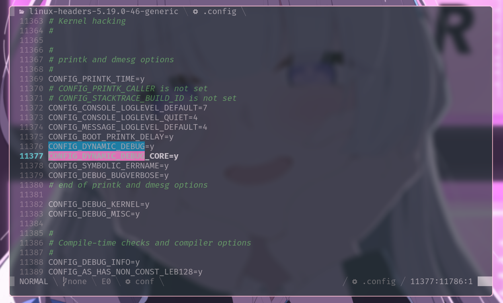
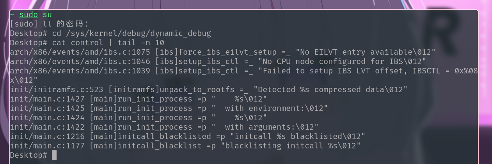
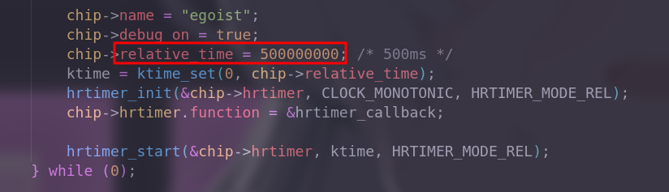
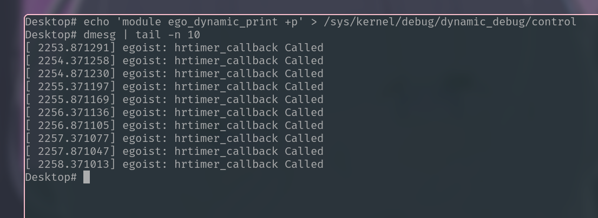

# Dynamic Print

| Date       | Author  | Description   |
| ---------- | ------- | ------------- |
| 2023/07/04 | Manfred | First release |

# Brief desribe

This mechanism is about to control `print switch` when kernel is running, `print switch` could be `pr_debug()/dev_dbg()`

**Condition**:

- Kernel Configuration : CONFIG_DYNAMIC_DEBUG = y
- debugfs has been mounted on system

**Check**

- [x] CONFIG_DYNAMIC_DEBUG



- [x] debugfs

    


# Method

### **Before compiling**

Add `ccflags` in Makefile to open dynamic print

```makefile
ccflags-y := -DDEBUG
ccflags-y += -DEVRBOSE_DEBUG
```

### **At runtime**

echo message to `/sys/kernel/debug/dynamic_debug/control`

**usage:**

```shell
# for file
echo 'file xxx.c +p' > /sys/kernel/debug/dynamic_debug/control
# for module
echo 'module xxx +p' > /sys/kernel/debug/dynamic_debug/control
# for function
echo 'func xxx +p' > /sys/kernel/debug/dynamic_debug/control
# for system
echo -n '+p' > /sys/kernel/debug/dynamic_debug/control
# for matching file
echo -n '+p' > /sys/kernel/debug/dynamic_debug/control
```

`-` stands for the opposite of `+`

**parameter**

- p : open dynamic print
- f : output the function name
- l : output the line
- m : output the module name
- t : output the thread ID

# Instance

A hrtimer is set to repeat execution at 500 ms, it will call `ego_debug`. In normal status, it cannot be observed on terminal. And if I turn the `dynamic print` on of this module or this `callback` function, Logs will be observed on terminal.




After I add `ccflags` in Makefile before compiling **or** echo messages to `control` at runtime, the result will be shown as below





