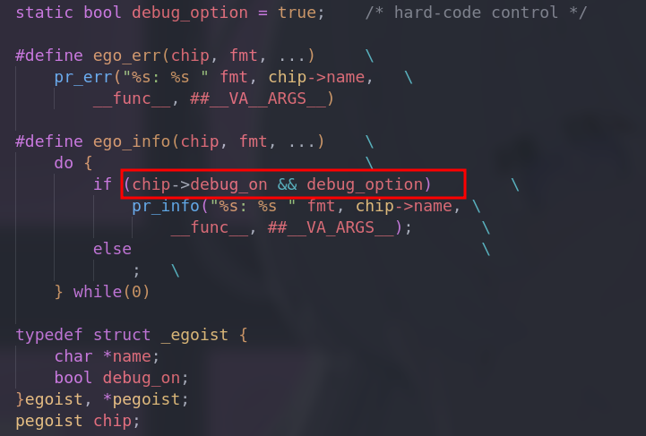
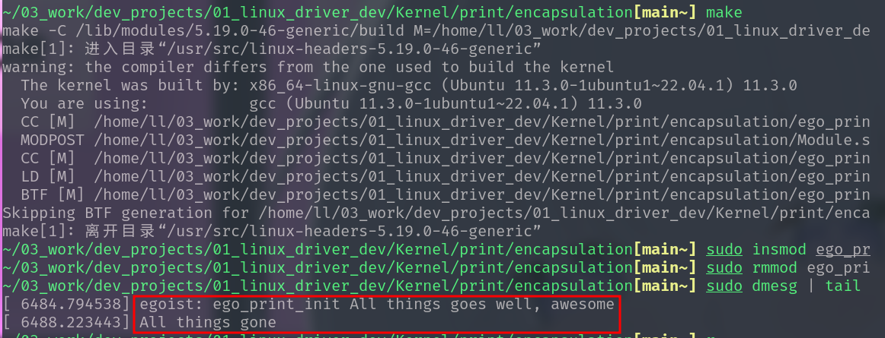

# Static Encapsulation

**[General description]**

Do further encapsulation to printk of kernel, add more identification information. 

At the same time, add flags for controls the debug switch.

**[Result]**

