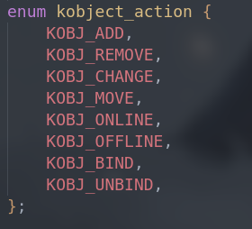
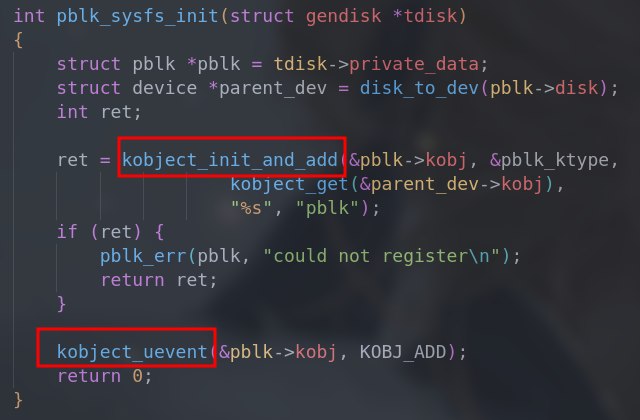
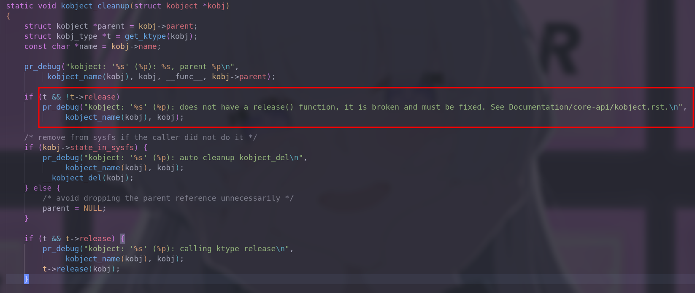
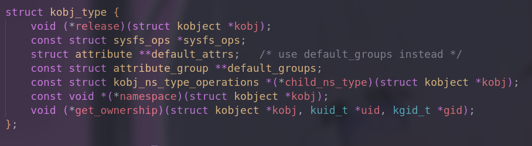
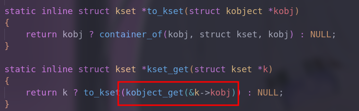
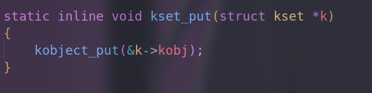
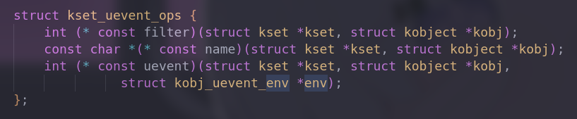

# linux设备模型

| Date       | Author  | Description   |
| ---------- | ------- | ------------- |
| 2023/07/30 | Manfred | First release |

**General description**

Linux Device Model，即linux设备模型，它是对系统结构的一般性抽象描述

- 电源管理和系统关机(抽象了设备之间的拓扑结构，使之成为一个多层次的体系结构)

    > 对电源的关闭需要由低层次到高层次

- 与用户空间通信(SYSFS)

    > 为用户空间提供一个与设备驱动交互的通用接口

- 热插拔设备

    > 热插拔事件是内和空间发送到用户空间的通知，对应`kobject`的创建和删除，最终调用`/sbin/hotplug`

- 设备类型

- 对象生命周期

    > 为`kobject`提供引用计数，当计数为0时，调用`release()`

以上，是LDM支持的主要功能


## kobject

`include/linux/kobject.h`

```c
struct kobject {
	const char		*name;
	struct list_head	entry;
	struct kobject		*parent;
	struct kset		*kset;
	struct kobj_type	*ktype;
	struct kernfs_node	*sd; /* sysfs directory entry */
	struct kref		kref;
#ifdef CONFIG_DEBUG_KOBJECT_RELEASE
	struct delayed_work	release;
#endif
	unsigned int state_initialized:1;
	unsigned int state_in_sysfs:1;
	unsigned int state_add_uevent_sent:1;
	unsigned int state_remove_uevent_sent:1;
	unsigned int uevent_suppress:1;
};
```

`kobject`通常嵌入到其他结构中，故与`container_of()`形影不离，`container_of()`的作用是**获得包含给定对象的结构指针**

> kobject存在的意义在于把高级对象连接到设备模型上[^1]

**Interested fields**

- parent

    > 实现标准分层体系结构，可以方便的定位对象

- kset

    > 另一种独立的分层体系结构的方法，将对象集合起来，特点是`包容`

- ktype

    > 为`kobject`提供一系列默认属性和配套操作

- kref

    > 引用计数

*more details to follow*

---

**API**

steps:

1. 定义一个 struct kobject 对象
2. 使用 kobject_init() 函数初始化 kobject 对象
3. 使用 kobject_add() 函数将 kobject 对象添加到父对象的 sysfs 目录中

| API            | 作用                                                         |
| -------------- | ------------------------------------------------------------ |
| struct kobject | 表示要添加到 sysfs 的对象                                    |
| kobject_init() | 初始化 kobject 对象，并为其分配资源                          |
| kobject_add()  | 将 kobject 对象添加到父对象的 sysfs 目录中，使之在 sysfs 中可见 |
| kobject_del()  | 与add相反                                                    |

> Note that：`kobject_add()`并不会通知用户空间，通知将由`kobject_uevent()`处理，下图是通知事件类型
>
> 

**demo**




## 引用计数

> 当引用计数归0时，支持该对象的代码将不复存在

**增加操作**

```c
/**
 * kobject_get() - Increment refcount for object.
 * @kobj: object.
 */
struct kobject *kobject_get(struct kobject *kobj)
{
	if (kobj) {
		if (!kobj->state_initialized)
			WARN(1, KERN_WARNING
				"kobject: '%s' (%p): is not initialized, yet kobject_get() is being called.\n",
			     kobject_name(kobj), kobj);
		kref_get(&kobj->kref);
	}
	return kobj;
}
EXPORT_SYMBOL(kobject_get);
```

如注释所示，该函数成功调用将增加`kobject`的引用计数，并返回指向`kobject`的指针

**减少操作**

```c
/**
 * kobject_put() - Decrement refcount for object.
 * @kobj: object.
 *
 * Decrement the refcount, and if 0, call kobject_cleanup().
 */
void kobject_put(struct kobject *kobj)
{
	if (kobj) {
		if (!kobj->state_initialized)
			WARN(1, KERN_WARNING
				"kobject: '%s' (%p): is not initialized, yet kobject_put() is being called.\n",
			     kobject_name(kobj), kobj);
		kref_put(&kobj->kref, kobject_release);
	}
}
EXPORT_SYMBOL(kobject_put);
```

减少`kobject`的引用计数，如果引用计数归零，则会调用`kobject_cleanip()`，最终会调用该`kobject`的`ktype->rekease`，如果未定义，则会警告




## ktype

为同类`kobject`对象提供默认属性（default_attrs/default_groups）和公共操作。当然，也支持自定义版本




## kset

> 独立于`parent`的另外一种用于连接各个对象以形成一个分层的结构体系的方式
>
> Note that：kset本身也嵌入了`kobject`，故也支持引用计数

```c
/**
 * struct kset - a set of kobjects of a specific type, belonging to a specific subsystem.
 *
 * A kset defines a group of kobjects.  They can be individually
 * different "types" but overall these kobjects all want to be grouped
 * together and operated on in the same manner.  ksets are used to
 * define the attribute callbacks and other common events that happen to
 * a kobject.
 *
 * @list: the list of all kobjects for this kset
 * @list_lock: a lock for iterating over the kobjects
 * @kobj: the embedded kobject for this kset (recursion, isn't it fun...)
 * @uevent_ops: the set of uevent operations for this kset.  These are
 * called whenever a kobject has something happen to it so that the kset
 * can add new environment variables, or filter out the uevents if so
 * desired.
 */
struct kset {
	struct list_head list;
	spinlock_t list_lock;
	struct kobject kobj;
	const struct kset_uevent_ops *uevent_ops;
} __randomize_layout;
```

kset的特点就是包容，如注释所写：kset定义了一组`kobject`，他们可以是不同的类型，但总的来说，这些`kobject`希望分组在一起，并以相同的方式进行操作

将一个`kobject`添加到`kset`的方式就是在add之前，将kset字段指向指定的`kset`


**操作**

创建`kset`并初始化

```c
/**
 * kset_register() - Initialize and add a kset.
 * @k: kset.
 */
int kset_register(struct kset *k)
{
	int err;

	if (!k)
		return -EINVAL;

	kset_init(k);
	err = kobject_add_internal(&k->kobj);
	if (err)
		return err;
	kobject_uevent(&k->kobj, KOBJ_ADD);
	return 0;
}
EXPORT_SYMBOL(kset_register);
```

`kset`也具有引用计数和名字，毕竟内嵌了`kobject`

**计数**





**设置名字**

```c
/**
 * kobject_set_name() - Set the name of a kobject.
 * @kobj: struct kobject to set the name of
 * @fmt: format string used to build the name
 *
 * This sets the name of the kobject.  If you have already added the
 * kobject to the system, you must call kobject_rename() in order to
 * change the name of the kobject.
 */
int kobject_set_name(struct kobject *kobj, const char *fmt, ...)
{
	va_list vargs;
	int retval;

	va_start(vargs, fmt);
	retval = kobject_set_name_vargs(kobj, fmt, vargs);
	va_end(vargs);

	return retval;
}
EXPORT_SYMBOL(kobject_set_name);
```

Note that：如果想修改已经添加到系统中的`kobject`，则需要使用`kobject_rename()`


**Interest fields**

`const struct kset_uevent_ops *uevent_ops`



uevent机制，即内核基于`kobject`通知用户空间的方式，**主要依托于 kset** ,可以传递`kobject`上发生的行为和环境变量，更多细节见**热插拔专题[^2]**


## sysfs

sysfs虚拟文件系统的主要作用为用户空间提供一个与设备驱动交互的通用接口

对于sysfs中的每一个目录，对应一个`kobject`，而一个`kobject`会输出一个或多个属性用于实现交互操作

---

前面提到过`kobject`在创建的时候，其字段`ktype`包含了该`kobject`的一系列属性，即默认属性

```c
/* 不感兴趣的字段已删除 */
struct kobj_type {
	const struct sysfs_ops *sysfs_ops; /* 默认操作 */
	struct attribute **default_attrs;	/* use default_groups instead */
	const struct attribute_group **default_groups; /* 默认属性 */
};
```

当然也可以添加/删除自定义属性，方式是定义一个属性后，把它创建到指定的`kobj`下

```c
static inline int sysfs_create_files(struct kobject *kobj,
				    const struct attribute * const *attr)
    
static inline void sysfs_remove_files(struct kobject *kobj,
				     const struct attribute * const *attr)
```

一个小demo：[ego_kobject.c](./ego_kobject.c)

后面的 bus/device/device_driver/class 都是标准`kobject`的封装实现的

---

**符号链接**

`static inline int sysfs_create_link(struct kobject *kobj, struct kobject *target, const char *name)`


**二进制属性**

//TODO


[^1]:原文出自《Linux设备驱动程序第三版》，page-362

[^2]:热插拔专题：TODO


